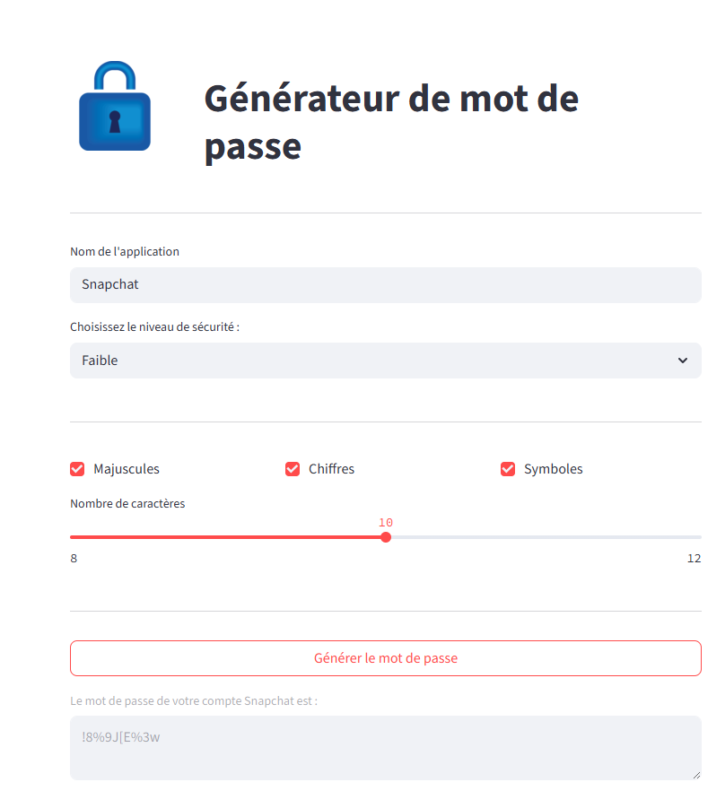

# Générateur de Mot de Passe - Streamlit

Bienvenue sur mon mini-projet **Générateur de Mot de Passe** développé avec **Python** et **Streamlit**.

Une application simple et sécurisée pour générer des mots de passe aléatoires selon vos préférences.

# Fonctionnalités

- Génération de mots de passe sécurisés
- Choix du niveau de sécurité :
  - Faible (8–12 caractères)
  - Moyen (12–16 caractères)
  - Élevé (16–20 caractères)
- Options personnalisables :
  - Lettres minuscules et/ou majuscules
  - Chiffres
  - Symboles spéciaux
- Interface responsive et intuitive
- Message dynamique : « Le mot de passe de votre compte X est : ... »

---

# Aperçu



---

# Lancer l'application

Assurez-vous d’avoir Python installé.

```bash
pip install streamlit
streamlit run front.py
